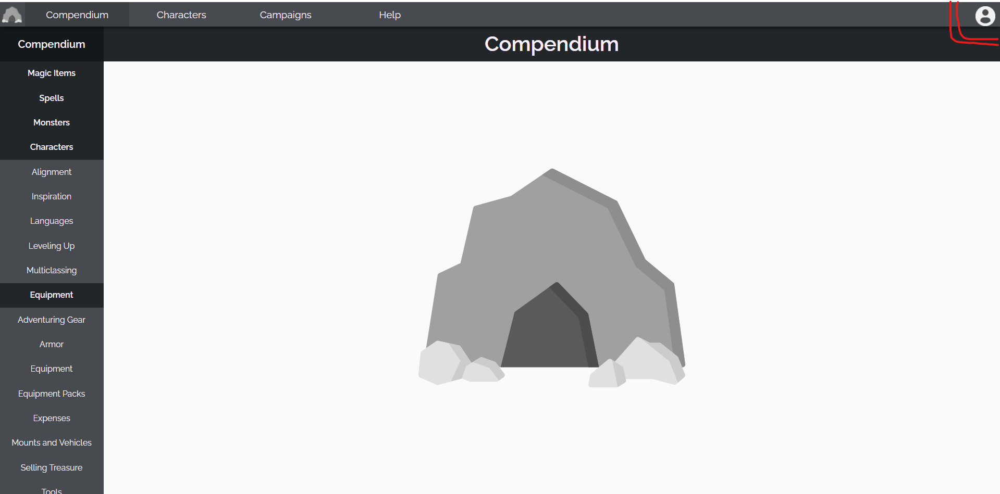

# Getting Started

## Logging In
To get started, click the **Account** button in the top right corner. This will open a Login dialog, and you can click the green "Create One" link at the bottom of the dialog to create a new account. Please remember your password, as there currently is no way to reset or retrieve it. You can then edit your account settings or log out again by clicking the account button.

